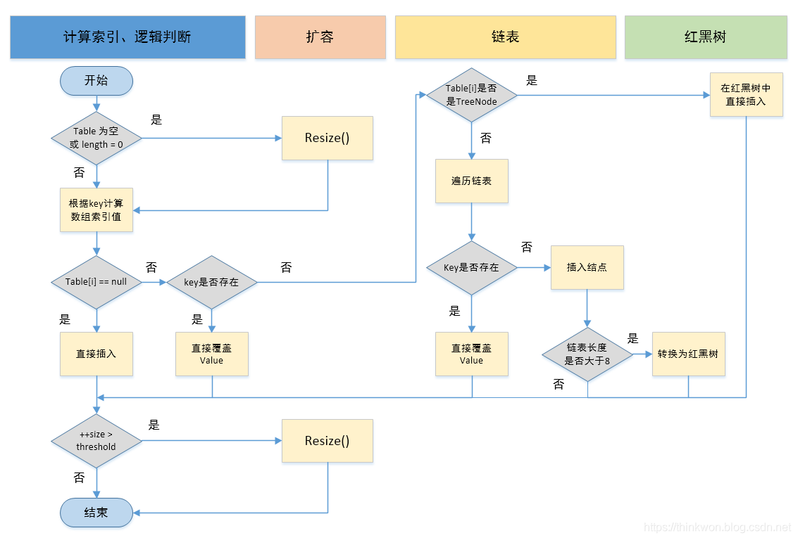

# Q&A For Java

## GC算法种类

Serial：使用复制算法，单线程，会暂停其他所有工作进程，效率高。年轻代收集算法，适用于小型应用。
Parallel：使用复制算法，吞吐量优先，适合后台运算缺少交互的任务。
CMS收集器：使用"标记-清除算法"，响应时间优先，减少垃圾收集停顿时间，适用于服务器、电信领域等。
G1收集器：

[Serial,Parallel,CMS,G1四大GC收集器特点小结](https://blog.csdn.net/u013812939/article/details/48782343)

[Serial收集器介绍](https://blog.csdn.net/weixin_44568697/article/details/109026412)

[Parallel 收集器](https://blog.csdn.net/sunwei_pyw/article/details/70114792)

[G1收集器的收集原理](https://www.cnblogs.com/lsgxeva/p/10231201.html)

## CMS(Concurrent Mark Sweep并发标记清除)算法

CMS算法是JVM中**老年代**常用的垃圾回收算法，全称是Concurrent Mark Sweep算法，即并发标记-清除算法。算法的执行步骤如下图所示，共有六个步骤。


一种可达性算法

1. 初步标记：触发Stop the world事件、标记与GCroot直接相连的的对象，以及被存活的青年代对象所引用的对象。
2. 并发标记：逐步标记步骤1中引用的对象，受老年代引用改变的影响。
3. 并发预处理：标记"脏块"(引用对象改变)、新进入老年代的对象，减少下一阶段重标记的工作量。
4. 重标记：触发Stop the world事件，收集器线程扫描在CMS堆中剩余的对象。扫描从"跟对象"开始向下追溯，并处理对象关联。
5. 并发清理：并发清理垃圾对象。
6. 并发重置：重置CMS收集器的数据结构，等待下一次的垃圾回收

[GC算法之CMS算法](https://blog.csdn.net/zy1994hyq/article/details/102495305)

## 线程池相关


### 队列策略

1. 无界队列：无界的LinkedBlockingQueue(可能无限制增长，引发OOM异常)
2. 有界队列:ArrayBlockingQueue、有界的linkedBlockingQueue、PriorityBlockingQueue
3. 直接移交(direct handoffs)：并不是一种队列，而是一种线程之间移交的策略。

### 拒绝策略

1. AbortPolicy终止策略(默认)，会抛出异常
2. DiscardOldestPolicy 抛弃策略：抛弃队列中最老(下一个被执行)的未处理的任务。不建议和优先队列一起使用。
3. DiscardPolicy 默默抛弃无法执行的任务
4. CallerRunsPolicy 交回调用者线程处理任务

### ArrayBlockingQueue和linkedBlockingQueue的区别

### 预定义线程池的种类

- FixedThreadPool：1. 全是核心线程 2. 使用LinkedBlockingQueue,无界阻塞队列 3. 无序执行任务
- CachedThreadPool：1. 线程数量几乎无限制 2. keepAliveTime = 60 3. 使用SynchronousQueue
- SingleThreadExecutor：单一线程，无界阻塞队列
- ScheduledThreadPool：定时调度任务线程池

[线程池之ThreadPoolExecutor概述](https://www.jianshu.com/p/c41e942bcd64)

[线程池之ThreadPoolExecutor使用](https://www.jianshu.com/p/f030aa5d7a28)

[线程池](https://www.jianshu.com/p/f030aa5d7a28)

[队列、抛弃策略](https://blog.csdn.net/mulinsen77/article/details/88987066)

[深入理解scheduledthreadpoolexecutor](https://www.jianshu.com/p/1cc47cfd355d)

## final,finally,finalize的区别

[参考文章](https://blog.csdn.net/qq_38542085/article/details/90913810)

## JMM


[深入理解java内存模型](http://ifeve.com/java-memory-model-0/)

## java集合介绍（List，Set，Map）

[java 集合基本概念​​​​](https://www.cnblogs.com/fooss/p/10182201.html)

## HashMap原理jdk7和jdk8的区别

[参考文章](https://blog.csdn.net/zshake/article/details/40956065?locationNum=6&fps=1)

1、实现方式：
jdk7中使用数组+链表来实现，jdk8使用的数组+链表+红黑树

2、新节点插入到链表是的插入顺序不同

3、jdk8的hash算法有所简化

4、扩容机制有所优化

## 线程池相关

为什么使用线程池？线程池的参数怎么设置？
[Java并发编程：线程池的使用](https://www.cnblogs.com/dolphin0520/p/3932921.html)

## 可重入锁和不可重入锁

[参考文章](https://www.cnblogs.com/dj3839/p/6580765.html)

## JDK7和JDK8concurrentHashmap区别

[参考文章](https://blog.csdn.net/qq_33642970/article/details/103965814)

## 面试必备：HashMap、Hashtable、ConcurrentHashMap的原理与区别

[参考文章](https://www.cnblogs.com/heyonggang/p/9112731.html)

## 单例模式

[手写单例模式](https://www.cnblogs.com/happyone/p/11221157.html)

1、 饿汉式(静态常量方式)

```java
public Class Singleton{
    private static Singleton intence = new Singletion();
    private Singleton(){}
    public static Singleton getIntence(){
        return intence;
    }
}
```

2、 饿汉式(`静态代码块`方式) 随着类的加载而执行，而且只执行一次 静态代码块----->非静态代码块-------->构造函数

```java
public Class Singleton{
    private static Singleton intence;
    static{
        intence = new Singleton();
    }
    private Singleton(){}
    public static Singleton getIntence(){
        return intence;
    }
}
```

3、 懒汉式(线程不安全)

```java
public Class Singleton{
    private static Singleton intence;
    private Singleton(){}
    public static Singleton getIntence(){
        if(intence == null){
            intence = new Singleton();
        }
        return intence;
    }
}
```

4、 懒汉式(线程安全，方法上加同步锁)

```java
public Class Singleton{
    private static Singleton intence;
    private Singleton(){}
    public static synchronized Singleton getIntence(){
        if(intence == null){
            intence = new Singleton();
        }
        return intence;
    }
}
```

5、 双重校验锁(线程安全，效率高)

```java
public Class Singleton{
    private volatile Singleton intence;
    private Singleton(){}
    public static Singleton getIntence(){
        if(intence == null){
            Synchronized(Singleton.class){
                if(intence == null){
                    intence = new Singleton();
                }
            }
        }
        return intence;
    }
}
```

6、 静态内部类实现单例(线程安全，效率高)

```java
public Class Singleton{
    private static class singletonHolder(){
        public static final Singleton intence = new Singleton();
    }
    private Singleton(){}
    public static final Singleton getIntence(){
        return singletonHolder.intence;
    }
}
```

## 类加载的机制？什么是双亲委托？如何打破双亲委托？


[参考文章](https://blog.csdn.net/wang465745776/article/details/112059308)

## 深入解析String Itern

[深入解析String#intern](https://tech.meituan.com/2014/03/06/in-depth-understanding-string-intern.html)

## JVM详细

[JVM](https://www.cnblogs.com/lfs2640666960/p/9297176.html)

## HelloWorld程序的执行流程（详细）

[helloWorld的执行流程](https://blog.csdn.net/xiaobai_hy/article/details/81380723)

## GC算法相关

一、什么是堆？
       堆指用于动态（即执行程序时）存放对象的内存空间。而这个对象，在面向对象的编程中，它指“具有属性和行为的事物”，然而在GC的世界中，对象表示的是“通过应用程序利用的数据的集合”。具体到Java堆，它是所有线程共享的一块内存区域，在虚拟机启动时创建。此内存区域的唯一目的就是存放对象实例，几乎所有的对象实例都在这里分配内存。（此处的对象实例可以理解为前面所说的对象，因为不仅仅Java有自动的GC，python、JavaScript等语言也有，所以在广义上说对象是更好的表述，当然，Java的数组也是分配在堆上的）。

二、GC算法的评判标准：吞吐量、最大暂停时间、堆的使用效率、访问的局部性

[参考文章](https://blog.csdn.net/iva_brother/article/details/87870576)

## Java获取键盘输入值的三种方法

方法一：利用System.in.read(需要格式转换，只能读取一个字符)
方法二：利用BufferedReader类和InputStreamReader类
方法三：利用Scanner类
[参考文章](https://blog.csdn.net/iteye_254/article/details/82513517)

## url访问, DNS相关

在浏览器地址栏输入一个URL后回车，背后会进行哪些技术步骤？

DNS怎么递归查询

本地域名服务器访问之后，更上一级的DNS服务的ip地址知道吗，是多少

可以配多个DNS服务器吗？它的访问顺序是怎么样的
我：不了解
好，继续，假设已经知道IP地址了，下一步怎么做

通过IP地址怎么找到MAC地址，会找到谁的MAC地址

你觉得阿里的公网IP地址会存到我们学校的局域网里面吗

## DNS递归查询与迭代查询

[DNS递归查询与迭代查询](https://www.cnblogs.com/qingdaofu/p/7399670.html)

## 重传机制

[参考文章](https://blog.csdn.net/whgtheone/article/details/80983882)

## TCP协议

[如何保证可靠传输](https://www.cnblogs.com/xiaokang01/p/10033267.html)  
[3次握手 4次挥手](https://www.cnblogs.com/xiaokang01/p/10032377.html)


你理解TIME_WAIT状态吗

为何一定要等 2MSL ？

## 在浏览器地址栏输入一个URL后回车，背后会进行哪些技术步骤？

[在浏览器地址栏输入一个URL后回车，背后会进行哪些技术步骤？](https://blog.csdn.net/fan1865221/article/details/88815336)

## HTTP与HTTPS的区别，详细介绍

[HTTP与HTTPS的区别，详细介绍](https://blog.csdn.net/qq_35642036/article/details/82788421)  
HTTPS的TLS握手  
SSL/TLS协议的基本过程

（1） 客户端向服务器端索要并验证公钥。
（2） 双方协商生成"对话密钥"。
（3） 双方采用"对话密钥"进行加密通信。
上面过程的前两步，又称为"握手阶段"（handshake）


## 进程同步机制

## 为什么重写equals就必须重写hashcode

[为什么重写equals就必须重写hashcode](https://blog.csdn.net/belongtocode/article/details/100183646)

## 重载和重写的区别

答：方法的重载和重写都是实现多态的方式，区别在于前者实现的是编译时的多态性，而后者实现的是运行时的多态性。重载发生在一个类中，同名的方法如果有不同的参数列表（参数类型不同、参数个数不同或者二者都不同）则视为重载；重写发生在子类与父类之间，重写要求子类被重写方法与父类被重写方法有相同的参数列表，有兼容的返回类型，比父类被重写方法更好访问，不能比父类被重写方法声明更多的异常（里氏代换原则）。重载对返回类型没有特殊的要求，不能根据返回类型进行区分。
[重载和重写的区别](https://blog.csdn.net/wintershii/article/details/80558739)

构造器(构造方法)是否可以被重写?/重载？

首先，构造器是不能被继承的，因为每个类的类名都不相同，而构造器名称与类名相同，所以根本谈不上继承。  
又由于构造器不能继承，所以就不能被重写。但是，在同一个类中，构造器是可以被重载的。

## jvm堆的分代思想

年轻代（Young Generation）：

所有首先新生成的对象都是放在年轻代的。年轻代的目标就是尽可能快速的回收掉那些生命周期短的对象 。

年轻代分为三个区：一个Eden区，两个Survivor区（一般情况）。大部分对象是在Eden区中生成。当Eden区满了，还存活的对象将被复制到Survivor区中（两个中的一个）。当这个Survivor也满了，此区还存活的对象将被复制到另一个Survivor中，当这个Survivor也满了还存活的对象会被复制到老年代。 当然可以配置多个Survivor增加对象在年轻代的生存时间。

年老代（Old Generation）：

在年轻代经过了N次GC还存活的对象就会被放到老年代。可以认为年老代中存放的都是一些相对生命周期长的对象。

持久代（Permanent Generation）：

用于存放静态文件，比如Java类，方法等。持久代对垃圾回收没有显著影响，但是有些应用可能动态生成或者调用一些class。
方法区也被称为永久代，如果不指定，GC回收的目标仅仅针对方法区的常量池和类型卸载。


注意：JDK8已经废弃了永久代，使用元空间（使用本地内存，而不是用的JVM的）

[JVM内存分代策略](https://www.cnblogs.com/fangfuhai/p/7206944.html)

[Java堆区划分—年轻代，年老代，持久代](https://blog.csdn.net/MoMo_F/article/details/80774889)

## mysql索引失效

[索引失效和组合索引的使用效果总结](https://blog.csdn.net/lanlianhua_luffy/article/details/104911498)

## jvm内存划分


[JVM内存划分](https://blog.csdn.net/suifeng629/article/details/82462164)
[一文搞懂JVM内存结构](https://blog.csdn.net/rongtaoup/article/details/89142396?utm_medium=distribute.pc_relevant.none-task-blog-BlogCommendFromMachineLearnPai2-4.control&dist_request_id=bcb9572d-0aba-430c-abdc-033cfe754ff9&depth_1-utm_source=distribute.pc_relevant.none-task-blog-BlogCommendFromMachineLearnPai2-4.control)

## MVCC多版本并发控制

- 什么是MVCC？

- 什么是快照读和当前读？

- MVCC在mysql中的实现原理？
(依赖记录中的 3个隐式字段，undo日志，Read View 来实现的)

- 第一类更丢失和第二类更新丢失？[参考文章](https://blog.csdn.net/chenyang1010/article/details/84425790)
- 数据库的3中并发场景和相应的问题？

    数据库并发场景有三种，分别为：
    读-读：不存在任何问题，也不需要并发控制
    读-写：有线程安全问题，可能会造成事务隔离性问题，可能遇到脏读，幻读，不可重复读
    写-写：有线程安全问题，可能会存在更新丢失问题，比如第一类更新丢失，第二类更新丢失

[参考文章](https://www.jianshu.com/p/8845ddca3b23)

2021-2-27

## MySQL事务隔离级别和实现原理

事务具有原子性（Atomicity）、一致性（Consistency）、隔离性（Isolation）、持久性（Durability）四个特性，简称 ACID，缺一不可。今天要说的就是隔离性。

- 脏读

脏读指的是读到了其他事务未提交的数据，未提交意味着这些数据可能会回滚，也就是可能最终不会存到数据库中，也就是不存在的数据。读到了并一定最终存在的数据，这就是脏读。

- 可重复读

可重复读指的是在一个事务内，最开始读到的数据和事务结束前的任意时刻读到的同一批数据都是一致的。通常针对数据更新（UPDATE）操作。

- 不可重复读

对比可重复读，不可重复读指的是在同一事务内，不同的时刻读到的同一批数据可能是不一样的，可能会受到其他事务的影响，比如其他事务改了这批数据并提交了。通常针对数据更新（UPDATE）操作。

- 幻读

幻读是针对数据插入（INSERT）操作来说的。假设事务A对某些行的内容作了更改，但是还未提交，此时事务B插入了与事务A更改前的记录相同的记录行，并且在事务A提交之前先提交了，而这时，在事务A中查询，会发现好像刚刚的更改对于某些数据未起作用，但其实是事务B刚插入进来的，让用户感觉很魔幻，感觉出现了幻觉，这就叫幻读。

SQL 标准定义了四种隔离级别，MySQL 全都支持。这四种隔离级别分别是：

- 读未提交（READ UNCOMMITTED）
- 读提交 （READ COMMITTED）
- 可重复读 （REPEATABLE READ）
- 串行化 （SERIALIZABLE）

从上往下，隔离强度逐渐增强，性能逐渐变差。采用哪种隔离级别要根据系统需求权衡决定，其中，**可重复读**是 MySQL 的默认级别。


[参考文章](https://zhuanlan.zhihu.com/p/117476959)

## 缓存穿透、缓存击穿、缓存雪崩区别和解决方案

**一、缓存处理流程**
前台请求，后台先从缓存中取数据，取到直接返回结果，取不到时从数据库中取，数据库取到更新缓存，并返回结果，数据库也没取到，那直接返回空结果。


二、缓存穿透

描述：

缓存穿透是指缓存和数据库中都没有的数据，而用户不断发起请求，如发起为id为“-1”的数据或id为特别大不存在的数据。这时的用户很可能是攻击者，攻击会导致数据库压力过大。

解决方案：

- 接口层增加校验，如用户鉴权校验，id做基础校验，id<=0的直接拦截；
- 从缓存取不到的数据，在数据库中也没有取到，这时也可以将key-value对写为key-null，缓存有效时间可以设置短点，如30秒（设置太长会导致正常情况也没法使用）。这样可以防止攻击用户反复用同一个id暴力攻击

三、缓存击穿

描述：

缓存击穿是指缓存中没有但数据库中有的数据（一般是缓存时间到期），这时由于并发用户特别多，同时读缓存没读到数据，又同时去数据库去取数据，引起数据库压力瞬间增大，造成过大压力

解决方案：

- 设置热点数据永远不过期。
- 加互斥锁，互斥锁参考代码如下：


说明：

1）缓存中有数据，直接走上述代码13行后就返回结果了

2）缓存中没有数据，第1个进入的线程，获取锁并从数据库去取数据，没释放锁之前，其他并行进入的线程会等待100ms，再重新去缓存取数据。这样就防止都去数据库重复取数据，重复往缓存中更新数据情况出现。

3）当然这是简化处理，理论上如果能根据key值加锁就更好了，就是线程A从数据库取key1的数据并不妨碍线程B取key2的数据，上面代码明显做不到这点。

四、缓存雪崩

描述：

缓存雪崩是指缓存中数据大批量到过期时间，而查询数据量巨大，引起数据库压力过大甚至down机。和缓存击穿不同的是，缓存击穿指并发查同一条数据，缓存雪崩是不同数据都过期了，很多数据都查不到从而查数据库。

解决方案：

- 缓存数据的过期时间设置随机，防止同一时间大量数据过期现象发生。
- 如果缓存数据库是分布式部署，将热点数据均匀分布在不同搞得缓存数据库中。
- 设置热点数据永远不过期。

## 谈谈volatile

java内存模型的三大特征: 原子性、可见性、有序性

happens-before 原则:

- 程序次序规则：一个线程内，按照代码顺序，书写在前面的操作先行发生于书写在后面的操作
- 锁定规则：一个unLock操作先行发生于后面对同一个锁额lock操作
- volatile变量规则：对一个变量的写操作先行发生于后面对这个变量的读操作
- 传递规则：如果操作A先行发生于操作B，而操作B又先行发生于操作C，则可以得出操作A先行发生于操作C
- 线程启动规则：Thread对象的start()方法先行发生于此线程的每个一个动作
- 线程中断规则：对线程interrupt()方法的调用先行发生于被中断线程的代码检测到中断事件的发生
- 线程终结规则：线程中所有的操作都先行发生于线程的终止检测，我们可以通过Thread.join()方法结束、Thread.isAlive()的返回值手段检测到线程已经终止执行
- 对象终结规则：一个对象的初始化完成先行发生于他的finalize()方法的开始

[参考文章](https://www.jianshu.com/p/9b1e73878741)

## java线程安全实现的3种方式

[参考文章](https://blog.csdn.net/qq_15371293/article/details/109921221)

1. 同步代码块
2. 同步方法
3. Lock锁机制， 通过创建Lock对象，采用lock()加锁，unlock()解锁，来保护指定的代码块

## HashMap put方法的流程



## hashcode()的作用

1. hashCode是为了提高在散列结构存储中查找的效率，在线性表中没有作用。

2. equals和hashCode需要同时覆盖。

3. 若两个对象equals返回true，则hashCode有必要也返回相同的int数。

4. 若两个对象equals返回false，则hashCode不一定返回不同的int数,但为不相等的对象生成不同hashCode值可以提高哈希表的性能。

5. 若两个对象hashCode返回相同int数，则equals不一定返回true。

6. 若两个对象hashCode返回不同int数，则equals一定返回false。

7. 同一对象在执行期间若已经存储在集合中，则不能修改影响hashCode值的相关信息，否则会导致内存泄露问题。

2021-2-25

# 注释相关

来源：[主流大厂最新Java注解面试问题[译]](https://blog.csdn.net/qq_37939251/article/details/83215703)

## 什么是注释？他们的典型用例是什么？

注释是绑定到程序源代码元素的元数据，对它们运行的​​代码的操作没有影响。

他们的典型用例是：

编译器的信息 - 使用注释，编译器可以检测错误或抑制警告
编译时和部署时处理 - 软件工具可以处理注释并生成代码，配置文件等。
运行时处理 - 可以在运行时检查注释以自定义程序的行为

## 可以从注释方法声明返回哪些对象类型？

返回类型必须是基本类型

## 是否可以扩展注释？

注释。注释总是扩展java.lang.annotation.Annotation，如Java语言规范中所述。

如果我们尝试在注释声明中使用extends子句，我们将得到一个编译错误：
