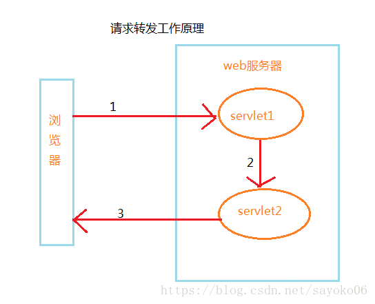
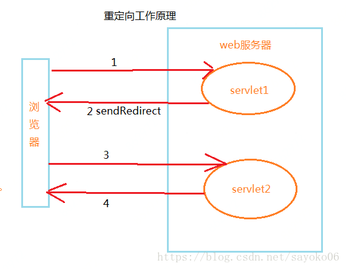

# forward和redirect的区别（转发和重定向的区别）

## 相同和异同点

相同点： 页面都会跳转

不同点：

1. 请求转发的时候URL不会发生变化    标识码：307
2. 重定向的时候，URL地址栏发生变化  标识码：302

## 过程和示意图

转发过程：客户浏览器发送http请求----》web服务器接受此请求--》调用内部的一个方法在容器内部完成请求处理和转发动作----》将目标资源发送给客户；在这里，转发的路径必须是同一个web容器下的url，其不能转向到其他的web路径上去，中间传递的是自己的容器内的request。在客户浏览器路径栏显示的仍然是其第一次访问的路径，也就是说客户是感觉不到服务器做了转发的。转发行为是浏览器只做了一次访问请求。

1. 浏览器向Servlet1发出访问请求；
2. Servlet1调用forward()方法，在服务器端将请求转发给Servlet2；
3. 最终由Servlet2做出响应



重定向过程：客户浏览器发送http请求----》web服务器接受后发送302状态码响应及对应新的location给客户浏览器--》客户浏览器发现是302响应，则自动再发送一个新的http请求，请求url是新的location地址----》服务器根据此请求寻找资源并发送给客户。在这里location可以重定向到任意URL，既然是浏览器重新发出了请求，则就没有什么request传递的概念了。在客户浏览器路径栏显示的是其重定向的路径，客户可以观察到地址的变化的。重定向行为是浏览器做了至少两次的访问请求的。

1. 浏览器向Servlet1发出访问请求；
2. Servlet1调用sendRedirect()方法，将浏览器重定向到Servlet2；
3. 浏览器向servlet2发出请求；
4. 最终由Servlet2做出响应。



## 示例代码

转发

```java
//Servlet里处理get请求的方法
public void doGet(HttpServletRequest request , HttpServletResponse response){
   //获取请求转发器对象，该转发器的指向通过getRequestDisPatcher()的参数设置
   RequestDispatcher requestDispatcher =request.getRequestDispatcher("转发的URL");
   //调用forward()方法，转发请求      
   requestDispatcher.forward(request,response);    
}
```

重定向

```java
//Servlet中处理get请求的方法
public void doGet(HttpServletRequest request,HttpServletResponse response){
//请求重定向到另外的资源
    response.sendRedirect("重定向的URL");
}
```