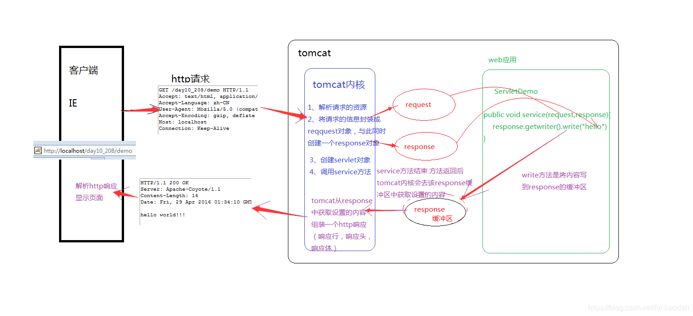
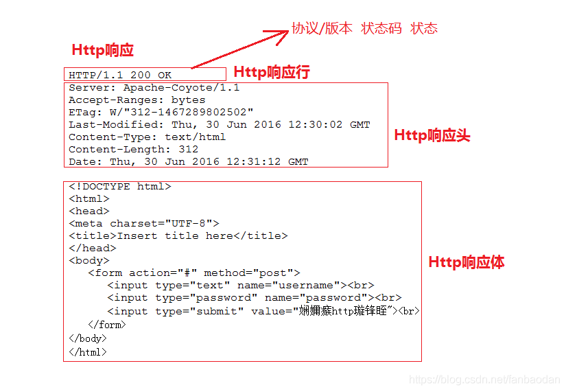

# HttpServletResponse接口

## HttpServletResponse概述:

位于`javax.servlet.http`包中，继承了`javax.servlet.ServletResponse`接口
在创建Servlet时会覆盖service()方法，或doGet()/doPost(),这些方法都有两个参数，一个为代表请求的request和代表响应response。service方法中的response的类型是ServletResponse，而doGet/doPost方法的response的类型是HttpServletResponse，HttpServletResponse是ServletResponse的子接口，功能和方法更加强大。

## 运行流程

## http响应

1). Server ：该响应头是服务器告诉浏览器，当前响应的服务类型和版本。

2). Content-Type响应头：服务器告诉浏览器响应内容是什么类型，以及采用的是什么字符编码。该响应头的值现在为：text/html;charset=utf-8。说明响应信息的类型是文本类型中的html，使用的字符编码是utf-8。

3). Content-Length响应头：服务器告诉浏览器，Content-Length响应头表明了响应实体的大小，该响应内容的长度现在是312个字节。

4). Date响应头：表示是服务器是在什么时候响应回浏览器，注意这里的时间是按照美国时间来计算。

5). Accept-Ranges: bytes - 该响应头表明服务器支持Range请求,以及服务器所支持的单位是字节(这也是唯一可用的单位).我们还能知道:服务器支持断点续传,以及支持同时下载文件的多个部分,也就是说下载工具可以利用范围请求加速下载该文件.Accept-Ranges: none 响应头表示服务器不支持范围请求.

6). Last-Modified：服务器上文件的最后修改时间

## 方法汇总

- getContextPath()：这个方法返回的是web应用映射的虚拟目录地址：如ServletDemo应用的虚拟目录是：/ServletDemo
- getCookies()：这个方法返回的是一个Cookies[]，我们在response容器那篇文章中看一个方法是向response容器中存入一个cookie的，这个方法是从Request容器中拿取多个cookies,因为用户在请求的时候会携带很多的cookie，关于Cookie的相关知识，我们会在后面的文章中进行详解
- getHeader(String name)/getIntHeader(String name)/getDateHeader(String name)：这些方法是获取请求头信息的，只是针对不同的类型的，有字符串类型的，时间类型，数值类型的
- getHeaderNames()：这个方法是获取所有请求头的字段名称
- getHeaders(String name)：这个方法是获取一个请求头字段的所有值，因为有时候可能会有相同请求头字段信息，不会覆盖的
- getMethod()：这个方法是获取客户机的请求方法
- getQueryString()：这个方法是获取用户请求时的查询参数的，即url后面携带的参数，如：`http://localhost:8080/ServletDemo/ServletRequest?username=jiangwei&password=123456`,那么getQueryString()方法返回来的值就是username=jiangwei&password=123456
- getRequestSessionId()：这个方法是获取客户机在请求的时候携带的sessionid值，有关session的相关知识，后面会详解
- getRequestURL()：这个方法是获取客户机请求的url
- getServletPath()：这个方法返回的是请求的Servlet的映射路径,比如：ServletRequest映射的是是/ServletRequest
- getServerName()/getServerPort()：这两个方法是获取服务器的名称和端口号，比如localhost,8080
- getSession()/getSession(boolean mode)：这两个方法是获取一个session对象，相关之后在session篇会说到
- getAttribute(String name)：这个方法是从Request域中获取值
- getAttributeNames()：这个方法是获取Request域中获取所有的字段名称
- getParameter(String name)：这个方法是获取用户使用get/post方式携带的参数值
- getParameterNames()：这个方法是获取用户请求时携带的所有参数名称
- getParameterMap()：这个方法是获取用户请求时携带的参数名称和参数值，并将其组装成一个Map对象
- getParameterValues()：这个方法是获取用户请求携带的参数值，因为有时候一个参数名称可能对应多个值
- setAttribute(String name,Object value)：这个方法是设置Request域中的属性值
- removeAttribute(String name)：这个方法是删除Request域中的属性值
- getInputStream()/getReader()：这个方法是获取用户请求的时候上传的输入流，比如我们在处理用户上传文件的时候。需要用到这个输入流
- setCharacterEncoding(String name)：这个方法是设置Request容器的编码
- getRemoteAddr()/getRemoteHost()：获取客户机的IP地址和主机名
- getProctocol()：获取协议名称
- getRequestDispatcher(String path)：获取一个转发对象RequestDispatcher，进行转发操作
