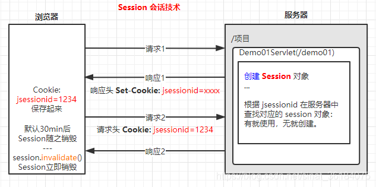
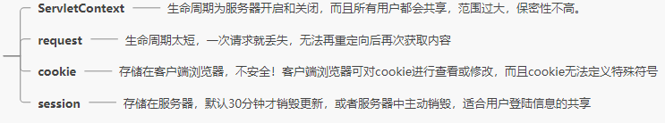
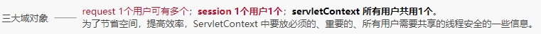

# session

参考:[Session的工作原理和应用详解](https://simple.blog.csdn.net/article/details/105674613?utm_medium=distribute.pc_relevant.none-task-blog-BlogCommendFromBaidu-1.control&depth_1-utm_source=distribute.pc_relevant.none-task-blog-BlogCommendFromBaidu-1.control)

## session原理

### session背景信息

服务器状态管理技术，将状态信息保存在服务器端

### session工作原理

### 共享范围

http域对象之一，服务器中可跨资源共享数据

### 生命周期

一般默认值是30分钟，在Tomcat中web.xml默认设置。  
结束时机：

- 浏览器关闭30分钟，销毁Cookie中的jsessionid = xxx
- session销毁：主动调用session.invalidate()

### http请求中的4大共享数据对比

### session应用

- 使用验证码登陆和共享用户信息